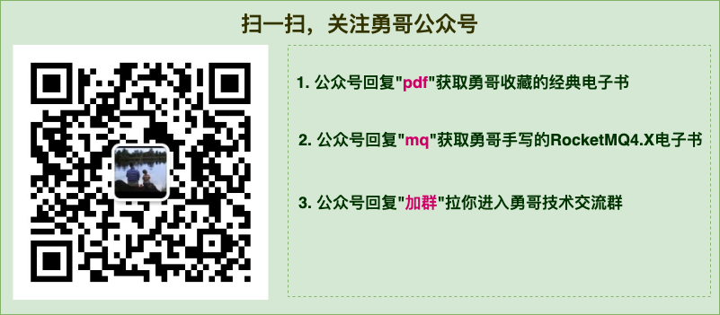
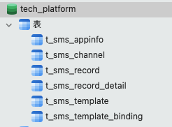
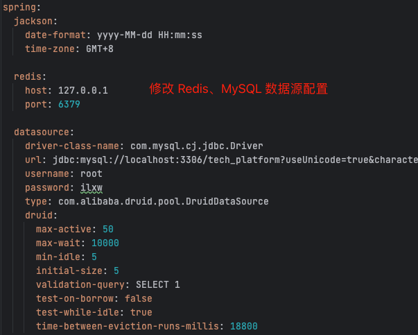
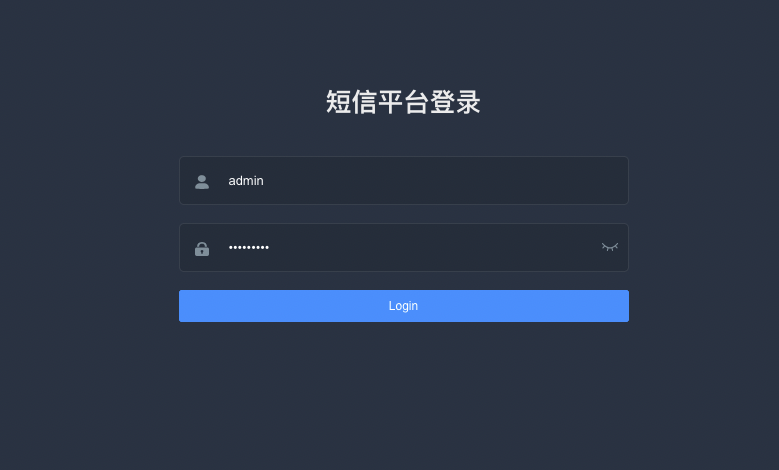
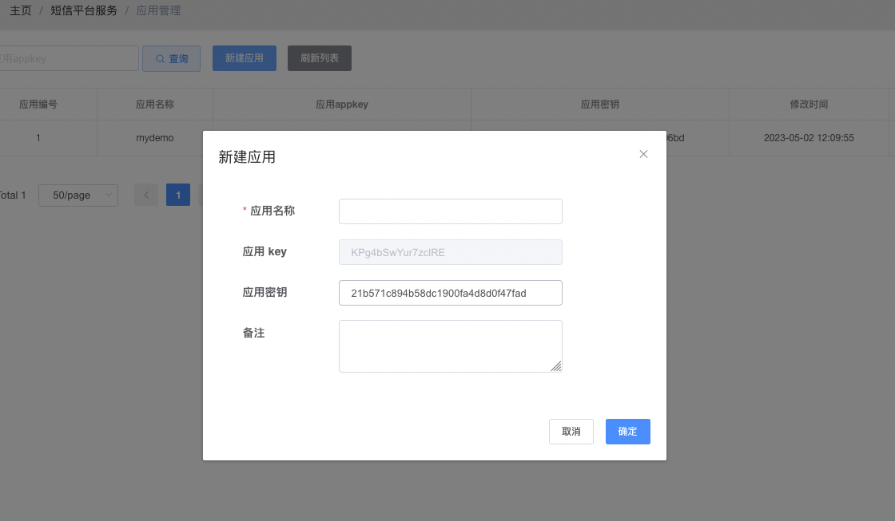
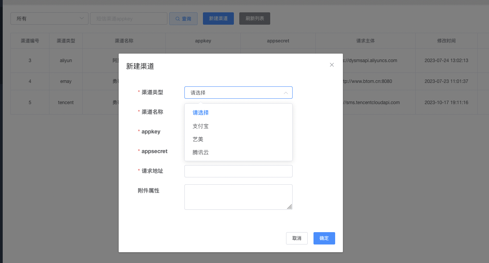
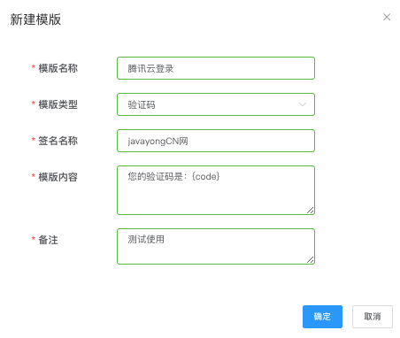
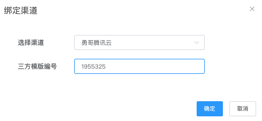

# 1 简介

一个简单易用的短信网关服务，提供客户端 SDK ，支持阿里云，腾讯云，亿美短信发送，适用于中小型公司。

功能包含：**应用管理**、**渠道管理**、**单发短信**、**单发短信**。

> 向了解客户端和服务端两种发送短信的模式，可以参看这篇文章：
> [Java应用中如何发送短信](https://mp.weixin.qq.com/s/hwMRHrBe4WxgxPkNXixIvg)


# 2 工作原理


核心流程如下：

1. 前端调用应用服务接口发送短信 ;
2. 应用服务收到短信请求后，调用 SDK 接口根据模版发送短信；
3. 短信平台服务收到请求，根据路由算法选择配置的渠道（比如阿里云、腾讯云）发送短信；
4. 短信成功发送到用户手机。

# 3 环境准备

短信平台服务是 JAVA 应用，所以必须安装 JDK（1.8或更高版本），安装并配置环境变量 JAVA_HOME，然后将包含在 JAVA_HOME 中的 bin 目录追加到 PATH 变量中。

短信平台服务依赖外部 **MySQL** 和 **Redis** 两个服务 ，所以在部署之前必须安装好前置数据库。


# 4 部署流程

## 4.1 创建数据库以及相关表

创建数据库`tech_platform` ，执行`  doc/sql` 目录下的 ` tech_platform.sql`。

执行后效果如下：



## 4.1 修改部署包配置

从 Release 下载 `platform-sms-admin.tar` ，解压缩后，进入 `conf `目录 。


编辑 `application.yml ` 文件：



进入 bin 目录，启动服务：

```sh
bin/startup.sh
```

# 5 操作流程

## 5.1 登录页面

服务启动后，访问地址：`http://localhost:8089` 。



> 用户名和密码存储在 `conf` 目录的 `application.yml`，默认用户名密码分别是：admin/admin1984 。

## 5.2 新建应用



应用信息包含应用名称、应用 `appKey` , `应用秘钥`，`备注`。其中，应用 key 和 密钥在使用客户端 SDK 时需要配置 。 

## 5.3 新建渠道



> 注意：因为腾讯云的 SDK 请求 中需要携带 APPID ，所以 Beta 版中将 appId 存储在 附件使用中。

## 5.4 创建模版

在`模版管理`模块，点击`新建模版`按钮。



**新建模版时，签名名称必须和渠道申请的签名必须一致。** 

下图展示了笔者的腾讯云申请的签名，笔者创建的模版必须和腾讯云账号的签名保持一致。 


创建完模版之后，需要绑定渠道，我们需要在三方渠道先创建短信模版，然后提交绑定。

**1、三方渠道先创建短信模版** 


如上图，笔者创建了编号为 1955325 的短信模版，因为我们需要在绑定界面绑定该渠道的模版，理论上在短信平台创建的模版可以绑定多个渠道。

**2、绑定渠道**



绑定完成之后，可以在模版管理页面查看模版列表 。


## 5.5 发送短信

发送短信可以参考 DEMO 模块：


### 01 添加依赖

```xml
<dependency>
    <groupId>com.courage</groupId>
    <artifactId>platform-sms-client</artifactId>
    <version>${parent.version}</version>
</dependency>
```

### 02 客户端配置

首先在 `application.yml `中配置如下：

```yaml
sms:
  smsServerUrl: http://localhost:8089
  appKey: qQjEiFzn80v8VM4h
  appSecret: 9c465ece754bd26a9be77f3d0e2606bd
```

然后编写配置类：

```
@Configuration
public class SmsConfiguration {

​    @Value("${sms.smsServerUrl}")
​    private String smsServerUrl;

​    @Value("${sms.appKey}")
​    private String appKey;

​    @Value("${sms.appSecret}")
​    private String appSecret;

​    @Bean
​    public SmsSenderClient createClient() {
​        SmsConfig smsConfig = new SmsConfig();
​        smsConfig.setAppKey(appKey);
​        smsConfig.setSmsServerUrl(smsServerUrl);
​        smsConfig.setAppSecret(appSecret);
​        SmsSenderClient smsSenderClient = new SmsSenderClient(smsConfig);
​        return smsSenderClient;
​    }

}

```

### 03 单发短信

```java
@Autowired
private SmsSenderClient smsSenderClient;

@GetMapping("/test")
public String test() {
    String mobile = "15011319235";
    String templateId = "523419101760679938";
    // 你好，你的信息是：${code}
    Map<String, String> param = new HashMap<String, String>();
    param.put("code", "1234");
    SmsSenderResult senderResult = smsSenderClient.sendSmsByTemplateId(mobile, templateId, param);
    System.*out*.println("senderResult:" + JSON.*toJSONString*(senderResult));
    return "hello , first short message !";
}
```
---
本工程参考了如下开源项目：
- canal